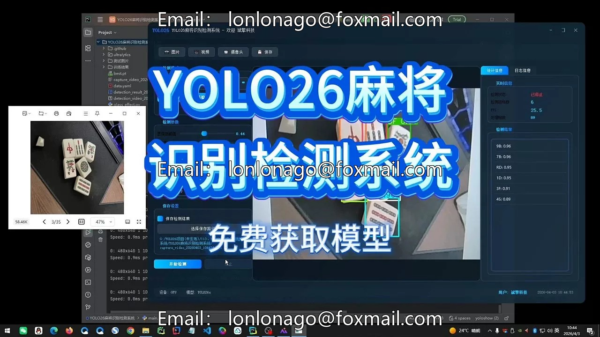
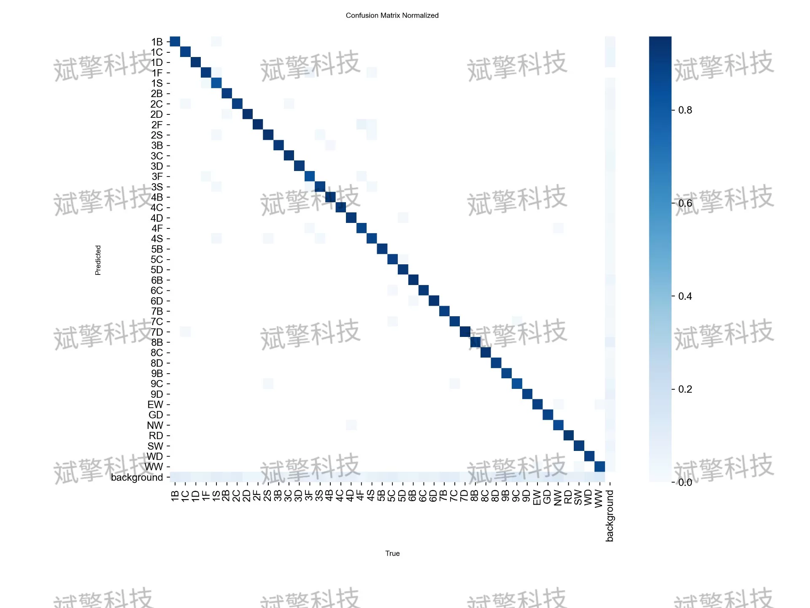
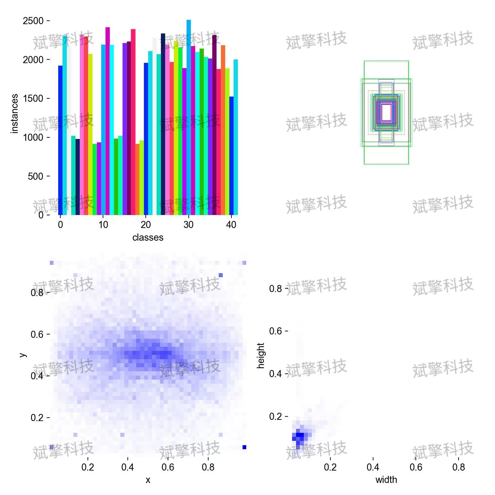
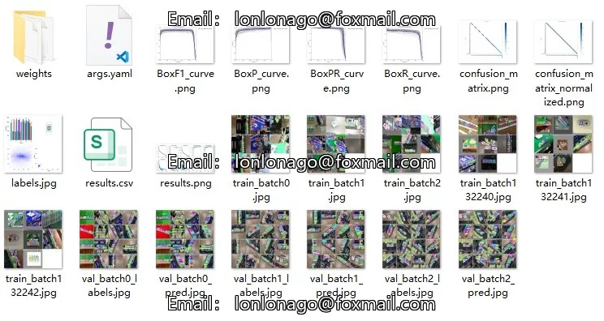
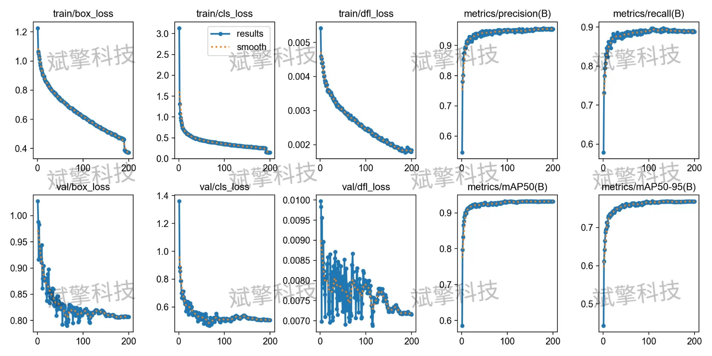
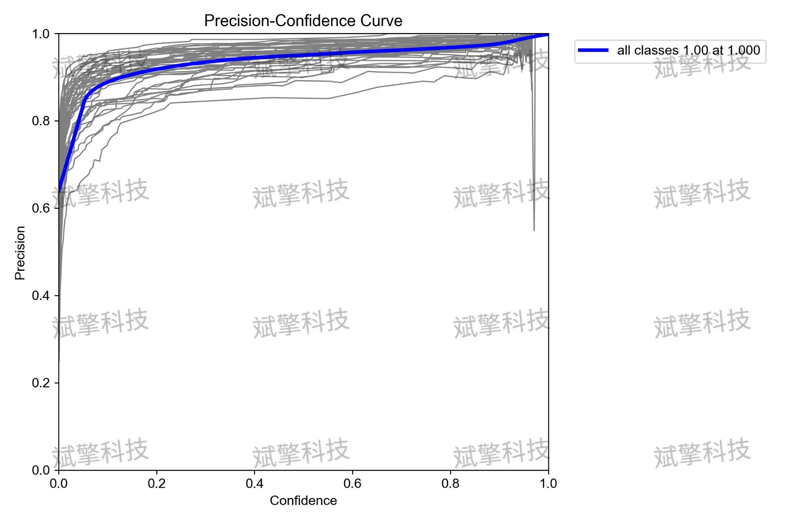
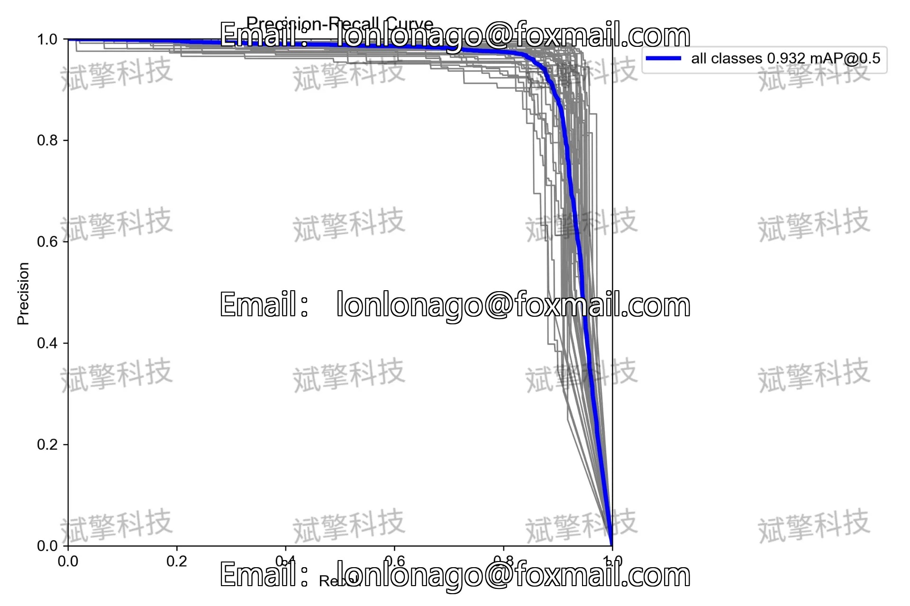
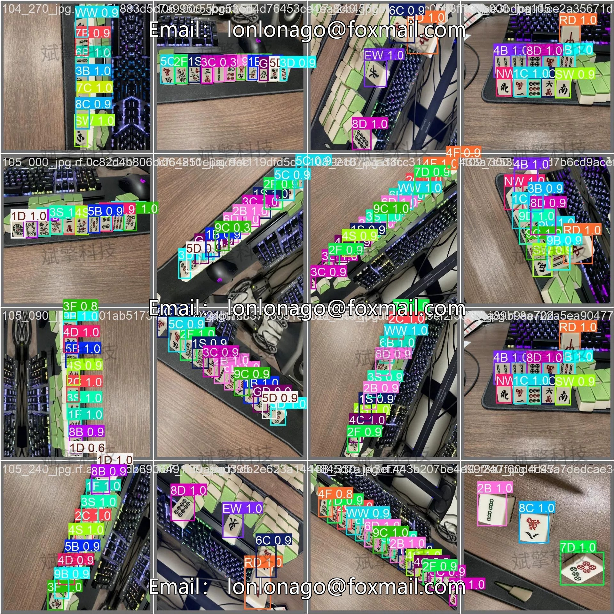
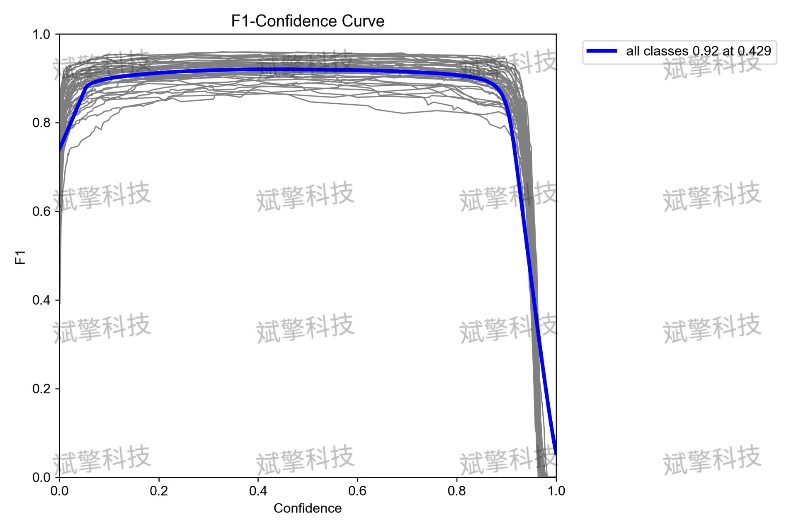

# YOLO26 Mahjong Detection System | Model + Source Code

## Body

YOLO26 Mahogany Identification and Detection System | Model + Source Code YOLO26 Mahogany Identification and Detection System (Project Source Code + Dataset + Model Weights + UI Interface + Python + Deep Learning + Remote Deployment)

This article is aimed at the task of identifying mahjong cards, and has built an automatic recognition system based on the YOLO26 object detection algorithm. The dataset contains a total of 6731 images, covering 42 categories (including Wan, Tang, Zhuang, and character cards). During the training process, the model exhibited excellent convergence characteristics, ultimately achieving an mAP@0.5 of 0.932 on the validation set, with the highest precision reaching 1.00. Experimental results show that this system can accurately identify various types of mahjong cards, demonstrating good practicality and deployment value.

The dataset used in this system is self-built for mahjong card detection, totaling 6731 images. The number of categories is 42, specifically including: 1B-9B, 1C-9C, 1D-9D (representing three types of suit numbers), as well as EW, GD, NW, RD, SW, WD, WW, etc. The dataset is divided as follows:
Training set    5565 张
Validation set    684 张
Test set    482 张

Free reservation for remote installation. Unsuccessful full refund.
Purchase enjoy the following resources (Baidu Drive auto unlock)
YOLO identification detection project complete source code
YOLO format dataset
Training code + UI interface code
Trained model + result image
Software install package
Add WeChat to make a reservation for remote installation (purchase after automatically displaying WeChat ID) - Unsuccessful full refund

⚙️ Core function modules
Detection capability
Image detection: upload and check immediately, return detection box + category information
Video detection: supports video files, analyze each frame precisely
Camera real-time detection: connect USB camera, realize dynamic monitoring
Interaction and control
Target screening: freely choose one or more categories for detection
Parameter real-time adjustment: adjustable confidence threshold & IoU threshold, flexibly control accuracy
Result saving: save images/videos/camera detection results in one click
System and data
User login registration: support password strength detection + encryption storage
Log recording: automatically record operation and error information (with timestamp)

## Images

## Payment

Here is a pay link on Stripe ( https://buy.stripe.com/3cs8yP7sY87d0vu9AB ). Please contact me lonlonago@foxmail.com after funding $89, and I will send you a complete data files , thank you!

